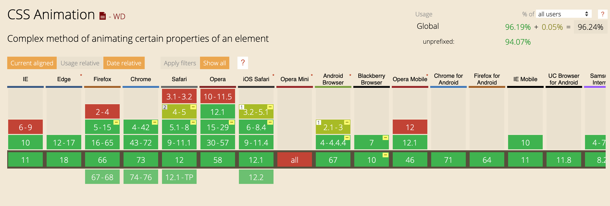

<style>
#loader {
    border-color: pink;
    border-top: red;
    border-radius: 50%;
    border-width: 5px;
    border-style: solid;
    height: 50px;
    width: 50px;
    margin: 0 auto;
    animation-name: spin;
    animation-duration: 1s;
    animation-iteration-count: infinite;
    animation-timing-function: linear;
    animation-direction: alternate;
    animation-delay: 2s;
}

@keyframes spin {
    0% {
        transform: rotate(0deg);
    }

    100% {
        transform: rotate(360deg);
    }
}

.heart-container {
    transform: rotate(-45deg);
}
.heart {
  background-color: red;
  display: inline-block;
  height: 30px;
  position: relative;
  top: 0;
  transform: scale(1);
  width: 30px;
}


.heart:before,
.heart:after {
  content: "";
  background-color: red;
  border-radius: 50%;
  height: 30px;
  position: absolute;
  width: 30px;
}

.heart:before {
  top: -15px;
  left: 0;
}

.heart:after {
  left: 15px;
  top: 0;
}

.transition-transform {
    transition: transform 0.2s;
}


.transition-transform:hover {
  transform: scale(1.5);
}

.animation-transform {
    animation: scale 1s infinite;
}

@keyframes scale {
    0% {
        transform: scale(1);
    }
    50% {
        transform: scale(1.5);
    }
    100% {
        transform: scale(1);
    }
}

.animation-color-scale {
    animation:
        scale  1s infinite,
        color 7s infinite;
}

.animation-color-scale.heart:before, .animation-color-scale.heart:after {
    animation: color 7s infinite;
}

@keyframes color {
    0% {
        background-color: red;
    }
    14% {
        background-color: orange;
    }
    28% {
        background-color: yellow;
    }
    42% {
        background-color: green;
    }
    56% {
        background-color: blue;
    }
    70% {
        background-color: indigo;
    }
    84% {
        background-color: violet;
    }
    100% {
        background-color: red;
    }
}

#css {
    font-size: 4rem;
    animation-name: font-color;
    animation-duration: 10s;
    animation-iteration-count: 2;
    animation-fill-mode: forwards;
}

#css:hover { 
    animation-play-state: paused;
}

@keyframes font-color {
    0% {
        font-size: 4rem;
    }

    100% {
        font-size: 8rem;
    }
}

.animation-scale-and-color {
    animation: scale-and-color 1s infinite;
}

.animation-scale-and-color.heart:before, .animation-scale-and-color.heart:after {
    animation: heart-color 1s infinite;
}

@keyframes scale-and-color {
    0% {
        transform: scale(1);
        background-color: red;
    }
    50% {
        transform: scale(1.5);
        background-color: blue;
    }
    100% {
        transform: scale(1);
        background-color: red;
    }
}

@keyframes heart-color {
    0% {
        background-color: red;
    }
    50% {
        background-color: blue;
    }
    100% {
        background-color: red;
    }
}

</style>

# CSS Animations

---

## What are they
CSS rules and properties that allow for elements to transition between styles

---

## Support


---

<div class="heart-container">
    <div class="heart transition-transform"></div>
</div>
## Transitions
 - Need a trigger to run (i.e. `:hover`)
 - Start/end state
 - Cannot loop

---
<div class="heart-container">
    <div class="heart animation-transform"></div>
</div>
## Animations
 - Don't need triggers
 - Multiple states other than start/end
 - Infinite replay

---

## Building Blocks
- `@keyframes` rule
- `animation` properties

----

<div class="heart-container">
    <div class="heart animation-transform"></div>
</div>
## `@keyframes` Rule
 - States the `animation-name`
 - Defines the stages for a single animation cycle
 - Specifies which properties to animate

```css
@keyframes scale {
    0% {
        transform: scale(1);
    }
    50% {
        transform: scale(1.5);
    }
    100% {
        transform: scale(1);
    }
}
```

----

<div class="heart-container">
    <div class="heart animation-transform"></div>
</div>
## `animation` Property
```html
<div class="heart"></div>
```
```css
.heart {
    ...
    animation-name: scale;
    animation-duration: 1s;
    animation-iteration-count: infinite;
}
```

----

## `animation` Property cont.
- animation-name
- animation-duration
- animation-timing-function
- animation-delay
- animation-direction
- animation-iteration-count
- animation-fill-mode
- animation-play-state

----

<div id="loader"></div>
```css
.loader {
    ...
    animation-name: spin;
    animation-duration: 1s;
    animation-timing-function: linear;
    animation-delay: 2s;
    animation-direction: alternate;
    animation-iteration-count: infinite;
}

@keyframes spin {
    0% {
        transform: rotate(0deg);
    }

    100% {
        transform: rotate(360deg);
    }
}
```

----

<h1 id="css">FELG</h1>
```css
#felg {
    ...
    animation-iteration-count: 2;
    animation-fill-mode: forwards;
    animation-play-state: running;
}
#felg:hover {
    animation-play-state: paused;
}
```

---

<div class="heart-container">
    <div class="heart animation-transform animation-color-scale"></div>
</div>
## Multiple Animations

```css
.heart {
    animation:
        scale  1s infinite,
        color 7s infinite;
}

@keyframes scale {
    0% {
        transform: scale(1);
    }
    50% {
        transform: scale(1.5);
    }
    100% {
        transform: scale(1);
    }
}

@keyframes color {
    0% {
        background-color: red;
    }
    14% {
        background-color: orange;
    }
    28% {
        background-color: yellow;
    }
    42% {
        background-color: green;
    }
    56% {
        background-color: blue;
    }
    70% {
        background-color: indigo;
    }
    84% {
        background-color: violet;
    }
    100% {
        background-color: red;
    }
}
```

---

<div class="heart-container">
    <div class="heart animation-transform animation-scale-and-color"></div>
</div>

## Multiple properties within a stage
```css
.heart {
    animation:
        scale-and-color  1s infinite;
}

@keyframes scale-and-color {
    0% {
        transform: scale(1);
        background-color: red;
    }
    50% {
        transform: scale(1.5);
        background-color: blue;
    }
    100% {
        transform: scale(1);
        background-color: red;
    }
}
```


